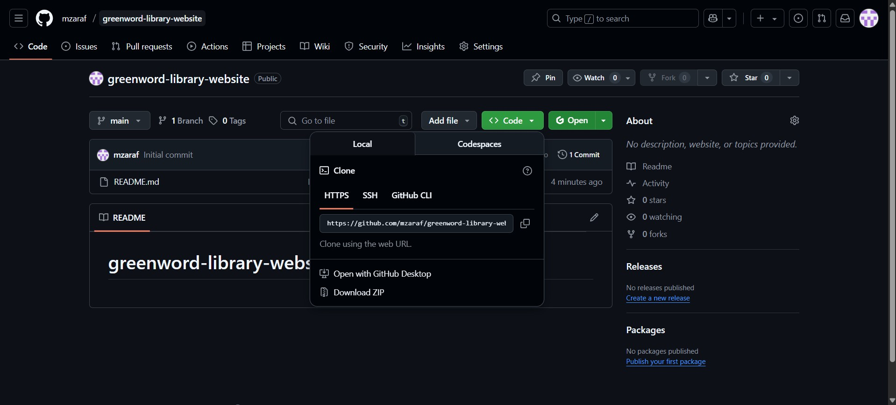
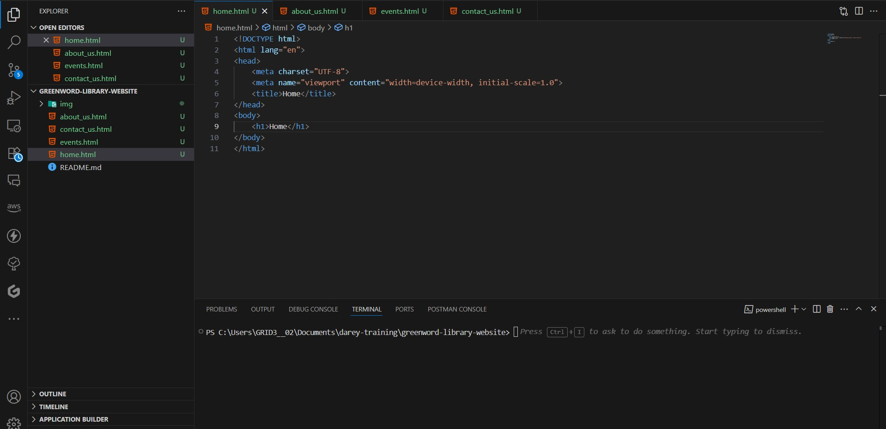
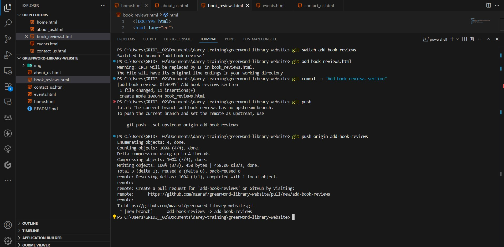
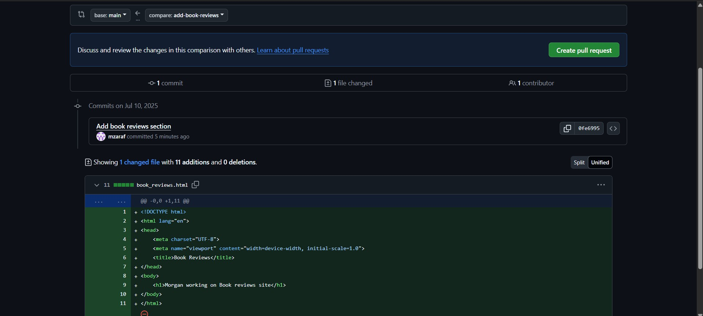
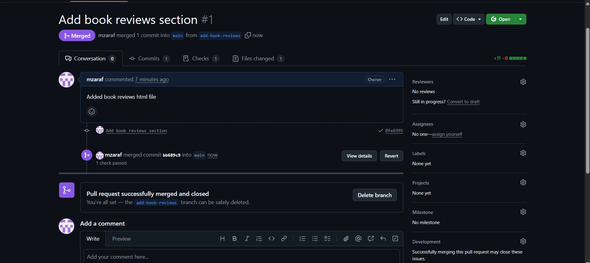
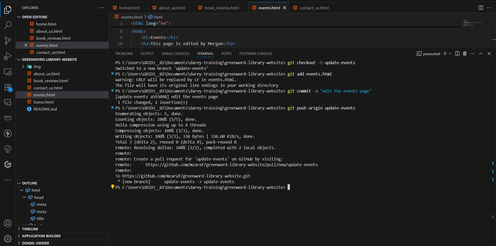
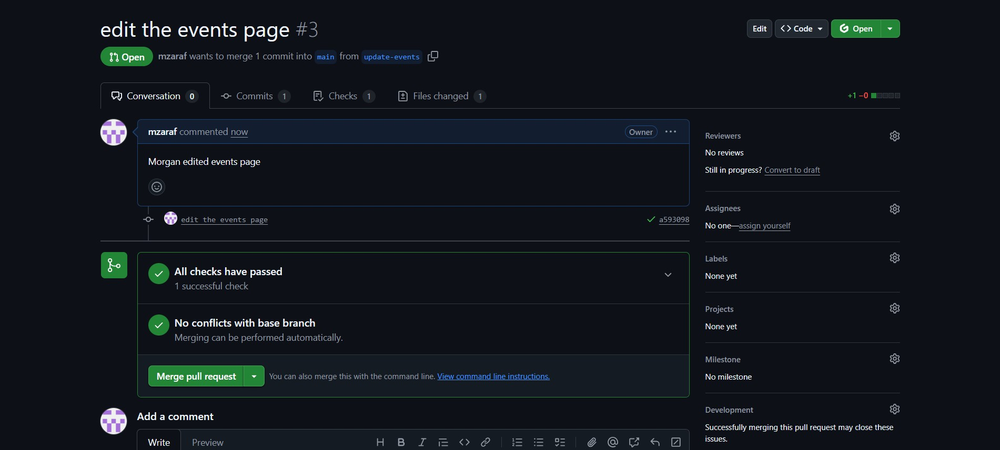
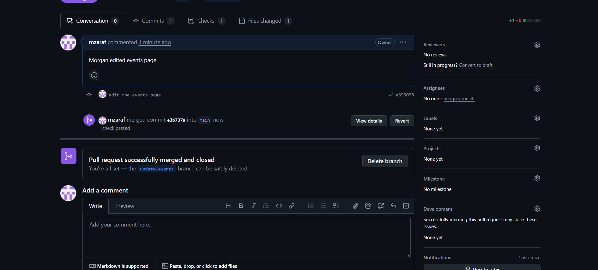

# greenword-library-website
## Setup
New repository greenword-library-website is created on github.  

Repo is cloned and the following files were subsiquently created in the root directory:  
home.html  
about_us.html  
events.html  
contact_us.html  

Then the main branch is staged commit and all changes are pushed to the remote repository.  

shown in screenshot below:

## Morgan's Work: Adding Book Reviews
New branch "add-book-reviews" was created and switch to the new branch.  

A new file "book_reviews.html" was added to the branch and changes where staged, commited and push to the branch's remote repository. 

Screenshot below:

On github page, a PR was raised and changes between the main and add-book-reviews branch were compared  

and successfully merged to the main branch.

## Jamie's Work: Updating Events Page
New branch "update-events" was created and switch to the new branch.  

The file "events.html" was updated and changes where staged, commited and push to the branch's remote repository. 

Screenshot below:

On github page, a PR was raised and changes between the main and update-events branch were compared  

and successfully merged to the main branch.

